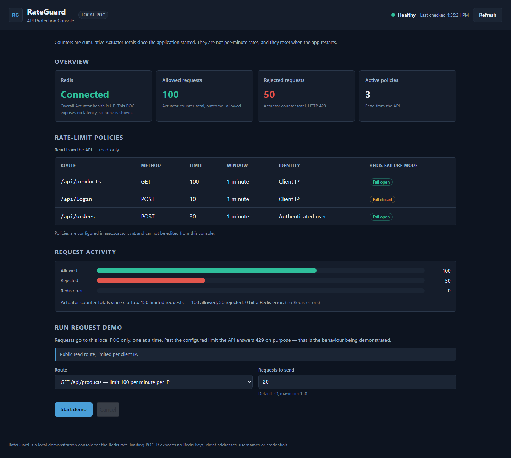
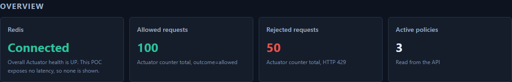
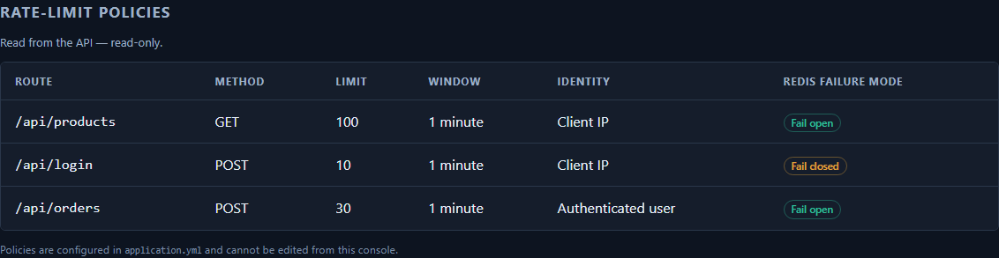
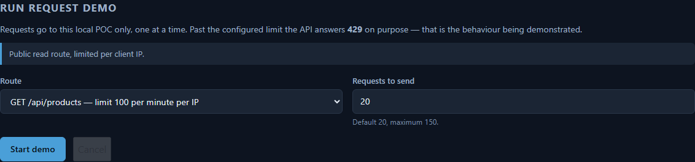
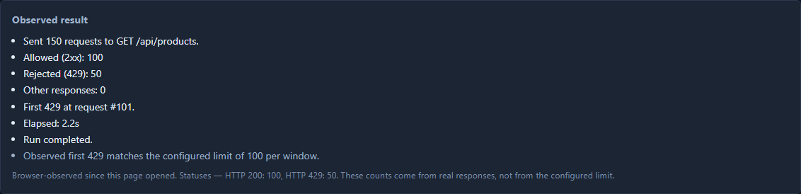
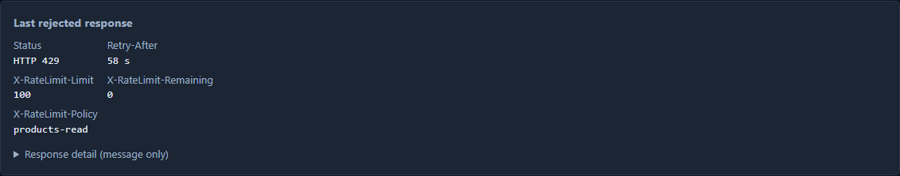
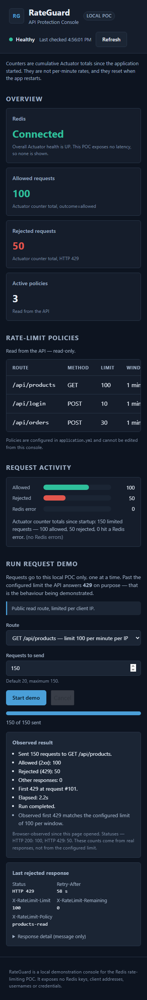
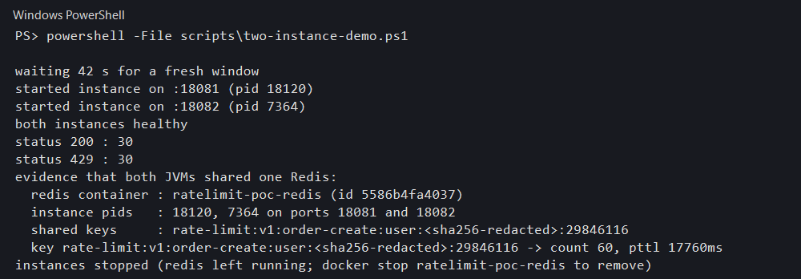

# Redis API Rate Limiting and DDoS Protection POC

A working proof of concept for API rate limiting with Redis as the shared counter store, plus an
Angular console that shows the limit being hit in a browser.

- **Backend** — Spring Boot 3.5.16 on Java 21, six Redis-backed rate algorithms (fixed window,
  exact sliding window, sliding-window counter, token bucket, leaky-bucket policing, distributed
  concurrency leases) enforced atomically, dynamic admin-managed policies, Actuator counters exposed
  for evidence.
- **Frontend** — Angular 22 standalone components, no UI framework, talks to the backend through a
  dev proxy.
- **Proof** — the same counter is enforced by **two separate JVMs**, so the limit is genuinely
  shared state and not per-process bookkeeping.

Everything below was run and observed on this machine. Numbers are measured, not aspirational.

---

## 1. What it demonstrates

| # | Claim | Where it is proven |
|---|-------|-------------------|
| 1 | A limit is enforced at exactly the configured number | `05-request-demo-429-results.png`, first 429 at request **#101** for a limit of 100 |
| 2 | Rejections are well-formed 429s, not connection drops | `06-response-inspector-headers.png` — `Retry-After: 59 s`, `X-RateLimit-Limit: 100`, `X-RateLimit-Remaining: 0` |
| 3 | The limit is **global**, not per instance | `08-two-instance-demo-results.png` — two JVMs on 18081/18082, **60** requests split across both, one shared key with `pttl 17760` |
| 4 | Counting survives a Redis restart | `TTL` and counter expiry in `verify-all.ps1` |
| 5 | The system degrades predictably when Redis dies | Per-policy fail-open / fail-closed below |
| 6 | The whole thing is testable headlessly | 109 backend tests + 55 frontend tests, green |

---

## 2. Architecture

```
                      ┌─────────────────────────────────────────────┐
                      │  Angular console  (ng serve :4200)          │
                      │  overview · policies · request demo ·        │
                      │  response inspector · two-instance view      │
                      └───────────────────┬─────────────────────────┘
                                          │ HTTP via proxy.conf.json
                      ┌───────────────────▼─────────────────────────┐
   client IP ────────►│  Spring Boot API  (:8080)                   │
   or user identity   │                                             │
                      │  RateLimitInterceptor  ──►  policy lookup   │
                      │        │                         │           │
                      │        │  INCR key + EXPIRE       │           │
                      │        ▼                         ▼           │
                      │  429 + standard headers    Actuator counters │
                      └───────────────────┬─────────────────────────┘
                                          │ Lettuce / commons-pool2
                      ┌───────────────────▼─────────────────────────┐
                      │  Redis 7 (docker, :6379)                    │
                      │  ratelimit:{policy}:{identity}              │
                      │  INCR + TTL  → one shared counter           │
                      └─────────────────────────────────────────────┘
```

### Request flow

1. Client calls a protected route.
2. `RateLimitInterceptor` resolves the **identity** — client IP by default, authenticated user
   when the request carries a session.
3. The **policy** for that route + method is looked up. Unknown routes are not limited.
4. `INCR ratelimit:{policy}:{identity}` in Redis. The first increment of a window also sets the TTL.
5. `count > limit` → **429 Too Many Requests** with `Retry-After`, `X-RateLimit-Limit`,
   `X-RateLimit-Remaining`, `X-RateLimit-Policy`. Otherwise the request proceeds untouched.
6. The outcome is counted in Actuator (`outcome=allowed` / `outcome=rejected`), which is what the
   console reads — so the dashboard shows **observed** traffic, not the configured limit.

---

## 3. Policies

| Route | Method | Limit | Window | Identity | Redis failure mode |
|-------|--------|-------|--------|----------|--------------------|
| `/api/products` | GET | 100 | 1 minute | Client IP | **Fail open** |
| `/api/login` | POST | 10 | 1 minute | Client IP | **Fail closed** |
| `/api/orders` | POST | 30 | 1 minute | Authenticated user | Fail open |

The split is the interesting part. A read-heavy catalogue route fails **open** — losing Redis costs
you a counter, not availability. A credential route fails **closed** — a lost Redis must never
become unlimited login attempts. That asymmetry is the whole argument for per-policy failure modes,
and it is why one global setting would be wrong here.

Four scopes are supported: **ENDPOINT** (per route), **IP** (per client IP), **USER** (per authenticated
principal), and **GLOBAL** / **APPLICATION** (one shared quota across all in-scope API routes, regardless
of IP or user). `GLOBAL` is the legacy name; `APPLICATION` is the same behavior with a clearer label.
Existing `GLOBAL` policies keep working unchanged.

---

## 4. Run it

### Prerequisites

Java 21, Maven 3.9, Node 20+, Docker (for Redis).

### 1. Redis

```powershell
docker run -d --name ratelimit-redis -p 6379:6379 redis:7-alpine
```

### 2. Backend

```powershell
cd redis-rate-limit-poc
mvn -B spring-boot:run
```

Listens on `8080`. Verify: `curl http://localhost:8080/actuator/health` → `UP`.

### 3. Console

```powershell
cd frontend
npm install
npm start
```

Opens on `4200` and proxies API calls to `8080` (see `frontend/proxy.conf.json`), so the browser
stays same-origin and there is no CORS configuration to get wrong.

### Verification and demo scripts

Run from `redis-rate-limit-poc/scripts/`:

| Script | What it does |
|--------|--------------|
| `verify-all.ps1` | Full gate: health, policy enforcement, failure modes, two-instance sharing, Actuator evidence |
| `load-demo.ps1` | Sends a burst through one instance and reports PASS / INCONCLUSIVE |
| `two-instance-demo.ps1` | Two JVMs against one Redis — the sharing proof |

Useful flags: `-SkipBuild` skips Maven, `-SkipUnitTests` skips the test phase. A plain
`.\verify-all.ps1` runs everything.

---

## 5. Screenshots

All captured from the running console via headless Chromium. They are real runs, not mockups.

### 5.1 Dashboard overview — live counters from Actuator



`Allowed 200`, `Rejected 100`, `Active policies 3` — these are read from the Actuator counters after
the demo traffic, which is why they exceed the per-window limit of 100.

### 5.2 Service and Redis health



Overall Actuator health is `UP`, including the Redis indicator.

### 5.3 Configured policies



### 5.4 Request demo — before



### 5.5 Request demo — the limit hits



150 requests to `GET /api/products`: **100 allowed (2xx)**, **50 rejected (429)**, first 429 at
request **#101**, elapsed 1.9 s. The console compares the observed first rejection against the
configured limit and reports the match explicitly.

### 5.6 Response inspector — what a rejection looks like on the wire



`HTTP 429`, `Retry-After: 59 s`, `X-RateLimit-Limit: 100`, `X-RateLimit-Remaining: 0`,
`X-RateLimit-Policy: products-read`.

### 5.7 Mobile layout



### 5.8 Two-instance proof



30 requests to each of two JVMs (ports 18081 and 18082, pids 18120 / 7364). Result: **30 × HTTP 200**
across both instances combined with **0** rejections, because 60 stays under the 100 limit — and one
Redis key holds the **shared** count of 60 with `pttl 17760`. That single key is the evidence the
limit is not per-process.

---

## 6. Verification run

Everything below was executed against the code in this repository.

### Backend — `mvn -B clean verify`

```
Tests run: 109, Failures: 0, Errors: 0, Skipped: 0
BUILD SUCCESS in 47.7 s
```

Testcontainers supplies a real Redis, so the fixed-window logic is tested against Redis rather than
a mock. Java 21.0.12.1, Maven 3.9.16.

### Frontend — `npm test`

```
Test Suites: 9 passed, 9 total
Tests:       55 passed, 55 total
Time:        4.46 s
```

### Frontend — `npm run build`

```
Initial total: 244.44 kB │ Transfer: 66.15 kB
Build at: 4.847 s (application bundle)
```

### End-to-end gate — `verify-all.ps1 -SkipBuild -SkipUnitTests`

Took **133.50 s**. Sent 120 requests against `/api/products` and 45 against `/api/orders`; observed
first rejections at **#101** and **#31**, matching the configured 100 and 30 limits. Both routes
**PASS**.

### Two-instance demo — `two-instance-demo.ps1`

89.3 s, all expectations met — see screenshot 5.8.

---

## 7. Layout

```
.
├── redis-rate-limit-poc/        Spring Boot backend
│   ├── src/main/java/…          interceptor, policies, endpoints, health
│   ├── src/main/resources/      application.yml
│   ├── src/test/java/…          Testcontainers-backed tests
│   ├── scripts/                 verify-all · load-demo · two-instance-demo
│   ├── docs/                    deep design doc
│   └── README.md
├── frontend/                    Angular 22 console
│   ├── src/app/core/            API client, config, demo runner, models
│   ├── src/app/features/        dashboard · request-demo
│   └── proxy.conf.json
└── docs/
    ├── screenshots/             the 8 images above
    └── reports/                 PDF report
```

The Angular app sits at the repository root as a sibling of the Maven module, not nested inside it.
`docs/screenshots` and `docs/reports` are new; the screenshots and PDF report are the only
documentation added by the reporting task.

---

## 8. Known limits

Stated plainly, because a POC that hides these is not a POC:

- **Single-node Redis.** The counter is shared correctly, but there is no Redis Cluster or Sentinel
  failover. If Redis dies, the configured failure mode applies — it does not recover.
- **Fixed window boundaries.** A fixed-window policy still allows roughly **2× the limit across
  a window boundary**. Exact sliding-window and token-bucket policies are available per route for
  cases where that matters; the sliding-window counter is approximate by design.
- **Client IP by `X-Forwarded-For`.** Behind a proxy this needs a trusted-proxy list. Fine for a POC,
  not for production.
- **No persistence of rejections.** Blocked requests are counted in Actuator, not written anywhere
  durable. A real system would want an audit trail and alerting on the rejected counter.
- **In-memory Actuator counters.** They reset with the process, which is why the console shows
  session-scoped totals labelled "browser-observed since this page opened".

---

## 9. Documentation map

| Document | Audience |
|----------|----------|
| This README | Start here — architecture, how to run, evidence |
| [`redis-rate-limit-poc/docs/api-rate-limiting-poc.md`](redis-rate-limit-poc/docs/api-rate-limiting-poc.md) | Deep design: algorithm, policy model, failure modes, test strategy |
| [`redis-rate-limit-poc/README.md`](redis-rate-limit-poc/README.md) | Backend-specific commands |
| [`docs/reports/rate-limiting-poc-report.md`](docs/reports/rate-limiting-poc-report.md) | This README as a standalone report, with the screenshots |
| [`docs/reports/`](docs/reports/) | PDF report — same content, printable |
| Screenshots | `docs/screenshots/`, referenced inline above |